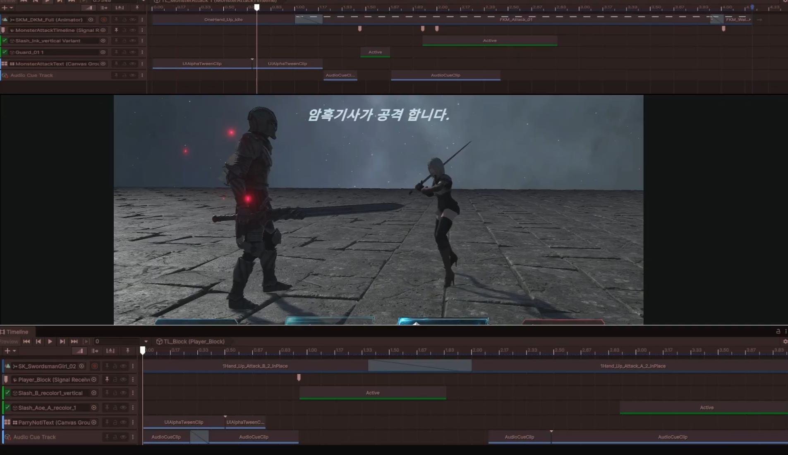

# Cinematic Turn RPG Combat System

Unity 6 기반으로 제작한 Timeline / Cinemachine 중심의 턴제 RPG 전투 포트폴리오입니다.  
기본 턴제 전투 흐름에 실시간 패링 입력, Timeline Signal 기반 공격 판정, 패링 성공 시 반격 시퀀스 전환을 적용했습니다.

## 시연 영상

[YouTube Demo](https://www.youtube.com/watch?v=CdqxunqTpkw)

## 스크린샷

### 전투 시작 / 기본 UI


### 패링 성공 / 반격 시퀀스


### Timeline 기반 전투 시퀀스


## 프로젝트 개요

이 프로젝트는 턴제 RPG 전투를 기반으로 하되, 단순한 명령 선택 방식이 아니라  
공격 연출 중 특정 타이밍에 실시간 패링 입력이 가능한 구조를 목표로 제작했습니다.

전투 로직, UI 상태, Timeline 연출 제어를 각각 분리하여  
전투 규칙 변경이나 연출 추가가 한 클래스에 집중되지 않도록 구성했습니다.

## 주요 구현 기능

### Timeline Signal 기반 전투 연출

공격, 피격, 패링, 반격 시퀀스를 Timeline으로 구성하고,  
Timeline Signal 시점에 실제 전투 판정과 연출 분기를 연결했습니다.

- 공격 Impact 시점에 데미지 및 패링 판정 처리
- 패링 성공 시 몬스터 공격 Timeline 중단
- 플레이어 반격 Timeline으로 전환
- Hit Stop, 카메라 연출, 피격 반응 연동

### 테이블 기반 캐릭터 / 스킬 데이터

캐릭터와 스킬 정보를 테이블 데이터 기반으로 구성했습니다.

- 캐릭터 HP / 공격력 / 프리팹 키 관리
- 스킬별 데미지 배율 관리
- 스킬별 패링 가능 여부 처리
- 스킬별 상태이상 적용

### 턴 / 상태이상 시스템

전투 상태와 턴 흐름은 BattleModel에서 관리합니다.

- PlayerTurn / MonsterTurn / Win / Lose 상태 관리
- 스턴 상태이상 처리
- 상태이상에 따른 턴 스킵
- 패링 요청 가능 구간 관리

### ViewModel 기반 전투 UI

전투 UI는 ViewModel 상태 변경을 통해 갱신되도록 구성했습니다.

- HP 표시
- 턴 텍스트 표시
- 공격 / 패링 버튼 활성화 제어
- Command UI / Turn UI Fade 처리
- UniRx 없이 경량 ObservableValue 사용

### Addressables 기반 캐릭터 생성

캐릭터 프리팹은 테이블의 PrefabKey를 기준으로 Addressables를 통해 생성합니다.

- 테이블 데이터 기반 캐릭터 선택
- Addressables InstantiateAsync 기반 생성
- AssetManager를 통한 리소스 접근 통합

### Assembly Definition 기반 코드 분리

Core, Battle, Intro 등 기능 단위로 Assembly Definition을 적용하여  
코드 의존성과 재컴파일 범위를 분리했습니다.

## 구조

```text
BattleController
 ├─ 플레이어 입력 처리
 ├─ 몬스터 행동 선택
 ├─ 스킬 실행 흐름 제어
 ├─ 턴 전환 처리
 └─ BattleModel / BattleCinematicDirector / BattleViewModel 연결

BattleModel
 ├─ 전투 상태 관리
 ├─ 데미지 계산
 ├─ 패링 판정
 ├─ 상태이상 적용
 └─ 턴 스킵 처리

BattleCinematicDirector
 ├─ Timeline 재생 제어
 ├─ Timeline Signal 처리
 ├─ 공격 / 피격 / 패링 / 반격 연출 연결
 ├─ Hit Stop 처리
 └─ 카메라 연출 제어

BattleViewModel
 ├─ HP View Data
 ├─ Turn Text State
 ├─ Skill Notice Text
 ├─ Button Interactable State
 └─ UI Visible State

UIBattleView
 ├─ ViewModel 바인딩
 ├─ 실제 UI 반영
 ├─ Button Event 전달
 └─ CanvasGroup Fade 처리
 ```

## 기술 스택

- Unity 6
- C#
- Timeline
- Cinemachine
- Addressables
- Assembly Definition
- UniTask
- DOTween
- UGUI / TextMeshPro
- JSON Table Data

## 개선 예정

- 커스텀 쉐이더를 활용한 전투 이펙트 개선
- 입력 장치별 QTE / 패링 UI 분기
- 스킬 종류 확장
- 추가 상태이상 처리
