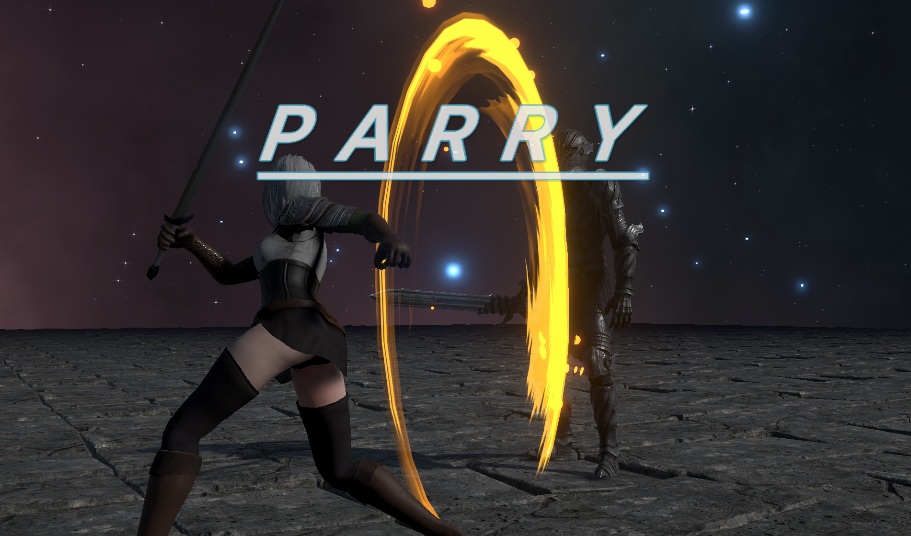
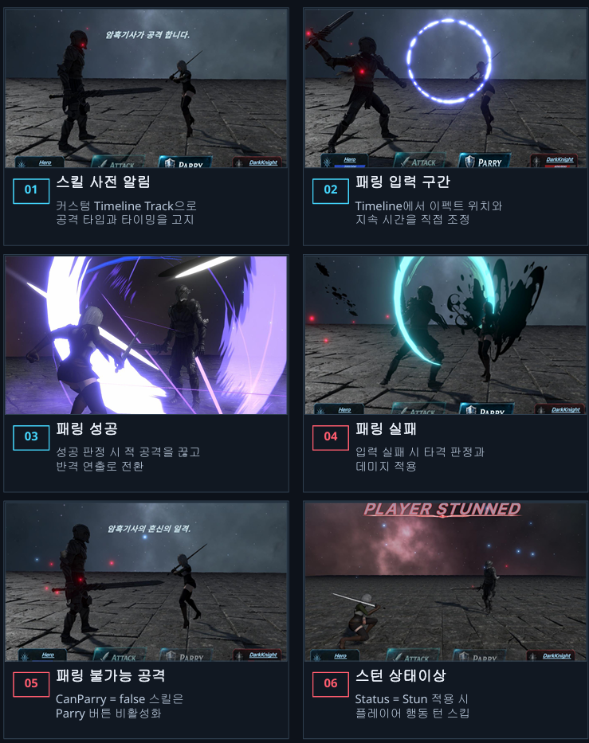
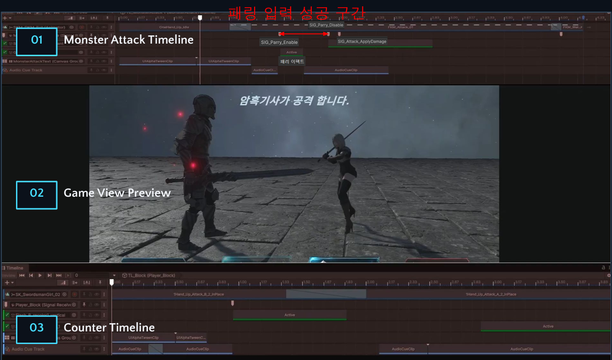

# Cinematic Turn RPG Combat System
**Timeline 기반 턴제 전투와 실시간 패링 시스템**

Unity 6 기반으로 제작한 Timeline 중심의 1:1 턴제 전투 프로젝트입니다.
턴제 전투에 실시간 패링을 결합하고, Timeline은 판정 시점만 전달하며 실제 전투 결과는 BattleModel에서 처리하도록 분리했습니다.

## 시연 영상

[YouTube Demo](https://www.youtube.com/watch?v=Gctl4hHu1ks)

> **Key Focus**  
> Timeline Signal → BattleResult → Hit / Parry 연출 분기

| 항목 | 내용 |
|---|---|
| 프로젝트 형태 | 1인 개인 프로젝트 |
| 구현 범위 | 기획, 클라이언트, 전투 시스템, UI, 연출 |
| 엔진 | Unity 6.4 / URP |
| 플랫폼 | Windows PC |
| 전투 구성 | 1:1 턴제 전투 + 실시간 패링 |
| 핵심 기술 | C#, Timeline, Cinemachine, DOTween, UniTask |

## 스크린샷

### 패링 성공 / 반격 시퀀스


### 전투 플레이 흐름

스킬 사전 알림부터 패링 입력, 성공·실패 분기, 패링 불가능 공격과 스턴 상태이상까지의 실제 전투 흐름입니다.



### Timeline 기반 전투 시퀀스

공격 애니메이션, 사전 알림, 패링 가능 구간, Impact Signal과 반격 시퀀스의 타이밍을 Timeline에서 조정합니다.



## 주요 구현 기능

### Timeline Signal 기반 전투 연출

공격, 피격, 패링, 반격 시퀀스를 Timeline으로 구성하고,  
Timeline Signal 시점에 실제 전투 판정과 연출 분기를 연결했습니다.

- 공격 Impact 시점에 데미지 및 패링 판정 처리
- 패링 성공 시 몬스터 공격 Timeline 중단
- 플레이어 반격 Timeline으로 전환
- Hit Stop, 카메라 연출, 피격 반응 연동

### 테이블 기반 캐릭터 / 스킬 데이터

캐릭터와 스킬 정보를 테이블 데이터 기반으로 구성했습니다.

- 캐릭터 HP / 공격력 / 프리팹 키 관리
- 스킬별 데미지 배율 관리
- 스킬별 패링 가능 여부 처리
- 스킬별 상태이상 적용

### BattleModel 기반 전투 규칙 판정

`BattleModel`은 전투 규칙과 상태 전이를 담당하며, UI와 Timeline 연출에는 직접 의존하지 않습니다.  
`BattleController`가 스킬 실행을 요청하면 현재 전투 상태와 스킬 데이터를 기준으로 결과를 판정하고, 이를 `BattleResult`로 반환합니다.

- 현재 `BattleState`와 플레이어·몬스터의 행동 가능 여부 판정
- `PowerRate`, `CanParry`, `ApplyStatus`를 기준으로 데미지·패링·상태이상 처리
- 턴 시작 시 Stun 상태를 확인하고 행동 스킵 및 다음 상태 결정
- 사망 여부에 따라 `Win` / `Lose` 상태 전환
- 패링 구간과 입력 요청을 관리하고, 판정 결과를 `BattleResult`로 반환

### ViewModel 기반 전투 UI

전투 UI는 ViewModel 상태 변경을 통해 갱신되도록 구성했습니다.

- HP 표시
- 턴 텍스트 표시
- 공격 / 패링 버튼 활성화 제어
- Command UI / Turn UI Fade 처리
- UniRx 없이 경량 ObservableValue<T> 사용

### Addressables 기반 캐릭터 생성

캐릭터 프리팹은 테이블의 PrefabKey를 기준으로 Addressables를 통해 생성합니다.

- 테이블 데이터 기반 캐릭터 선택
- Addressables InstantiateAsync 기반 생성
- AssetManager를 통한 리소스 접근 통합

### Assembly Definition 기반 코드 분리

Core, Battle, Intro 등 기능 단위로 Assembly Definition을 적용하여  
코드 의존성과 재컴파일 범위를 분리했습니다.

## 구조

```text
BattleController
 ├─ 플레이어 입력 처리
 ├─ 몬스터 행동 선택
 ├─ 스킬 실행 흐름 제어
 ├─ 턴 전환 처리
 └─ BattleModel / BattleCinematicDirector / BattleViewModel 연결

BattleModel
 ├─ 전투 상태 관리
 ├─ 데미지 계산
 ├─ 패링 판정
 ├─ 상태이상 적용
 └─ 턴 스킵 처리

BattleCinematicDirector
 ├─ Timeline 재생 제어
 ├─ Timeline Signal 처리
 ├─ 공격 / 피격 / 패링 / 반격 연출 연결
 ├─ Hit Stop 처리
 └─ 카메라 연출 제어

BattleViewModel
 ├─ HP View Data
 ├─ Turn Text State
 ├─ Skill Notice Text
 ├─ Button Interactable State
 └─ UI Visible State

UIBattleView
 ├─ ViewModel 바인딩
 ├─ 실제 UI 반영
 ├─ Button Event 전달
 └─ CanvasGroup Fade 처리
 ```

## 기술 스택

- Unity 6
- C#
- Timeline
- Cinemachine
- Addressables
- Assembly Definition
- UniTask
- DOTween
- UGUI / TextMeshPro
- Newtonsoft.Json
- JSON Table Data

## 개선 예정
- 입력 장치별 QTE / 패링 UI 분기
- 몬스터 행동 선택 정책과 전투 시나리오 데이터 분리
- BattleModel 상태 전이 단위 테스트와 Timeline Signal 검증 도구 추가

## 리소스 안내

게임 내 캐릭터, 애니메이션, 배경, VFX 및 사운드 일부는 Unity Asset Store와 외부 무료 리소스를 활용했습니다.  
프로젝트의 전투 시스템, 데이터 처리, UI 흐름, Timeline 연동과 시네마틱 제어 코드는 개인 작업으로 구현했습니다.
